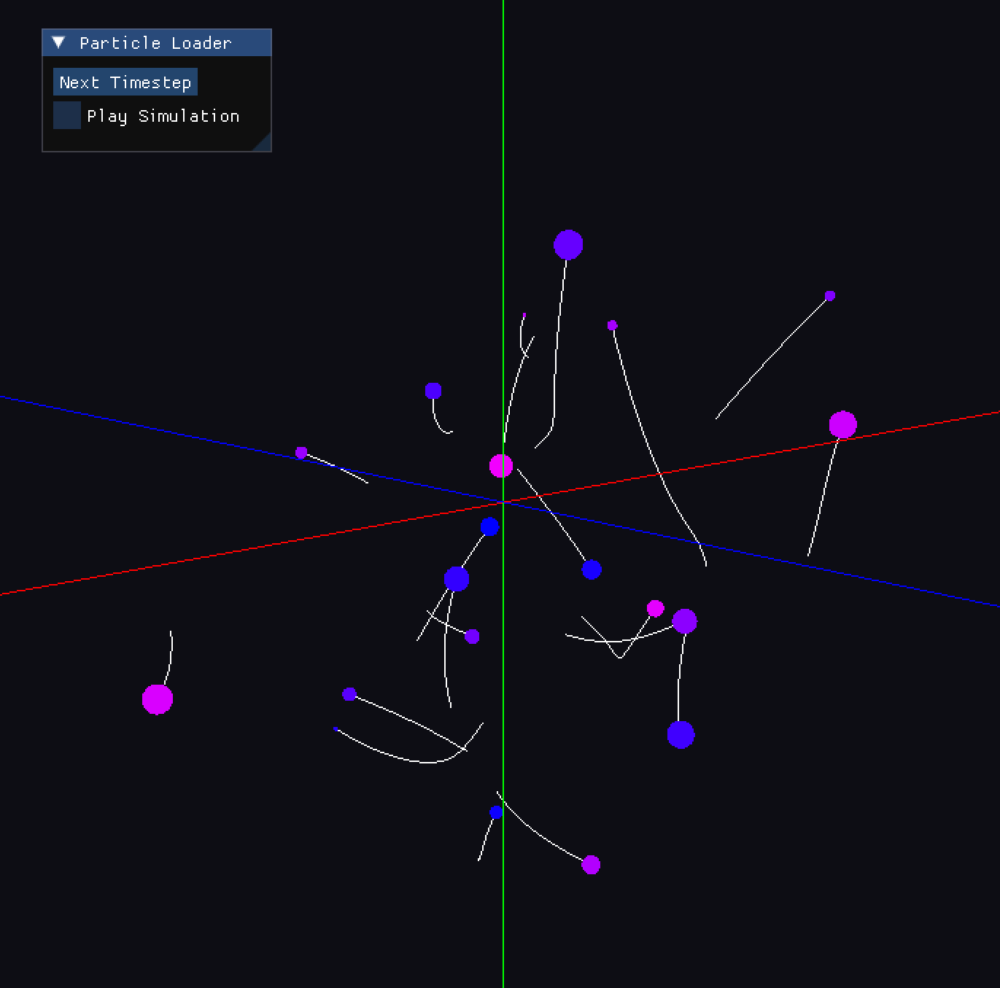

# NBody
### What is an NBody Problem?

It refers to the challenge of predicting the motion of bodies over time and how how N bodies interact with each other beccause of influence of their forces such as gravity. It's highly complex compared to a 2 body problem due to the fact that each object is simultenliously affected by all the others which leads to a choatic behaviour.

This project contains multiple implementations of the N-body problem for comparison between serial, parallel, and reduced versions of the algorithm. 

Using the generated data, a visualization tool is provided using OpenGL and GLFW to show the particles. It reads the generated files (for easier cluster offloading in the future) and can either play the simulation loop or load the next time frame one step at a time.



## Building

The optional executable for visualisation has dependencies that are provided as git submodules, so make sure that you clone the repository with the `--recurse-submodules` option or use
```bash
git submodule update --init --recursive
```
on an already cloned repository.

There are two CMake options available:
 * `BUILD_SIMULATION` (default: `ON`) Build the simulation executables
 * `BUILD_VISUALISATION` (default: `OFF`) Build the visualisation executable

### Simulation

First, make sure that you have an environment with MPI installed. 
For instance, open the container used in the laboratories and load the `gcc-glibc` module.
Then, create and enter a build directory and run `cmake ..` to configure the build system. 
Finally, running `make` should build all simulation-related targets.

### Visualisation

The container used in the laboratories does not support OpenGL. 
Therefore, visualisation targets are set up to be optional.
To build them, first ensure that your environment supports OpenGL (i.e. you are not inside the laboratory container) and that you have fetched all git submodules.
Then, create a new build directory (different from the one configured for simulation) and enter it.
To configure the build environment only for the visualisation target run
```bash
cmake .. -DBUILD_SIMULATION=OFF -DBUILD_VISUALISATION=ON
```
and then to build the target, simply run `make`.

## Sequential algorithms

For both the Basic and Reduced sequential algorithms, a **struct** including mass, position, and velocity was defined for the particles to increase data locality. Since the force matrix requires initialization to zero at every iteration, we chose to keep it separate from the struct so that all its elements are stored in contiguous memory cells.

As the Euler method does not enforce **energy conservation**, a total_energy function was implemented to verify that the system's total energy variation remains negligible. Tests confirmed the model's validity, showing that as dt approaches zero, the energy variation decreases as expected.

The **computing time** for the Basic version was verified to be significantly higher than the Reduced one. This is due to the Reduced version halving the number of arithmetic operations by exploiting Newton's third law, although both algorithms technically maintain $O(N^2)$ complexity. Both solvers share a similar implementation structure to facilitate performance comparison.

Extensive **stress tests** were performed in both 2D and 3D to ensure code robustness, including scenarios with high particle counts, star-planet systems, clusters with outliers, near-frontal collisions, small gravitational constants, and extreme mass/speed values. Both solvers handled all cases successfully. Furthermore, comparing the outputs of the two solvers across various inputs consistently showed identical results.

## MPI implementation

MPI implementation is done for both Basic and Reduced versions, following the algorithms described in the Pacheco book[1].

In the Basic version, the MPI root process (the one with rank 0) scatter the particle information in a blocked distribution. Moreover, the masses and initial positions are broadcasted to each MPI process. At each simulation step, the velocities and positions for local particles are updated, and then each process gathers all new position information using `MPI_Allgatherv`. In short, in the Basic version, after each simulation step, the MPI processes share the new positions with all the other processes.

In the Reduced version, a ringpass algorithm is used. Processes are connected in a ring: process `i` is connected to `i-1` and `i+1` (and largest ranked process is connected to process with rank 0). Initially, the processes know only the particle data for their local particles. At each simulation step, the algorithm performs P-1 phases (where P is the number of MPI processes). At each phase, each MPI process sends data to a lower-ranked neighbor, and receives from a higher-ranked data. With this new data, the process computes all inter-particle forces, and adds to a local force array, while the opposite forces are subtracted from the passing buffer of the forces. Lastly, one more exchange is done and then each process can sum all the forces that they got during this process. 

The Reduced version is faster as it avoids all-to-all gathering at every simulation step.

## Execution time comparison

The comparison made with generated random file using `utils::generateRandomToFile<3>("test-timer.in", 1000, 5000, 0.01, 42);`, i.e. 1000 particles and 5000 steps.

| **Algorithm** | Execution time (seconds) |
|--------------|----------|
| **Serial Basic** | 29.152 |
| **Serial Reduced** | 20.187 |
| **MPI Basic** (4 processes) | 10.639 |
| **MPI Reduced** (4 processes) | 3.492 |

## Integrators

The integrator advances the system by updating particle **positions and velocities** based on gravitational accelerations.
Different integrators approximate these variables differently, affecting accuracy, stability, energy conservation, and computational cost.

---

### Euler
Updates position using the old velocity, then updates velocity using the current acceleration. It is the simplest to implement but unstable with strong energy drift.

$$
s^{n+1} = s^n + v^n \Delta t, \quad
v^{n+1} = v^n + a^n \Delta t
$$


---

### Symplectic Euler
Updates velocity first and then advances position using the new velocity. Same cost as Euler, but much better long-term stability.

$$
v^{n+1} = v^n + a^n \Delta t, \quad
s^{n+1} = s^n + v^{n+1} \Delta t
$$


It's good for cheap long simulations.

---

### Velocity Verlet
Splits the velocity update into two half-steps and recomputes acceleration after the position update. Second-order, symplectic, and energy-stable. And manages to have a very good balance between accuracy and stability

$$
v^{n+\frac12} \rightarrow s^{n+1} \rightarrow a^{n+1} \rightarrow v^{n+1}
$$


It's usually the default integrator** for N-body simulations.

---

### Runge–Kutta 4 (RK4)
Uses four slope evaluations per timestep to achieve high accuracy. Very accurate short-term but not symplectic and more expensive.

#### Stage 1
$$
\mathbf{k}_1^{x} = \mathbf{v}^n
$$
$$
\mathbf{k}_1^{v} = \mathbf{a}(\mathbf{x}^n)
$$

#### Stage 2
$$
\mathbf{k}_2^{x} = \mathbf{v}^n + \frac{\Delta t}{2} \mathbf{k}_1^{v}
$$
$$
\mathbf{k}_2^{v} = \mathbf{a}\left(\mathbf{x}^n + \frac{\Delta t}{2} \mathbf{k}_1^{x}\right)
$$

#### Stage 3
$$
\mathbf{k}_3^{x} = \mathbf{v}^n + \frac{\Delta t}{2} \mathbf{k}_2^{v}
$$
$$
\mathbf{k}_3^{v} = \mathbf{a}\left(\mathbf{x}^n + \frac{\Delta t}{2} \mathbf{k}_2^{x}\right)
$$

#### Stage 4
$$
\mathbf{k}_4^{x} = \mathbf{v}^n + \Delta t \, \mathbf{k}_3^{v}
$$
$$
\mathbf{k}_4^{v} = \mathbf{a}\left(\mathbf{x}^n + \Delta t \, \mathbf{k}_3^{x}\right)
$$

---

### Final Update

The position and velocity are updated as follows:

$$\mathbf{x}^{n+1}=\mathbf{x}^{n}+\frac{\Delta t}{6}\left(\mathbf{k}_1^{x}+2\mathbf{k}_2^{x}+2\mathbf{k}_3^{x}+\mathbf{k}_4^{x}\right)$$


$$\mathbf{v}^{n+1}=\mathbf{v}^{n}+\frac{\Delta t}{6}\left(\mathbf{k}_1^{v}+2\mathbf{k}_2^{v}+2\mathbf{k}_3^{v}+\mathbf{k}_4^{v}\right)$$


It's best performance is for short runs and validation because of its high accuracy.

## Integration challenges

### Abstraction of the particle type
   Position, velocity, and mass are always needed. Other information can optionally be passed via `Attributes`.
   ```c++
   template <int DIM, typename Attributes> 
   struct body {
   public:
     virtual Vec<DIM> &pos() = 0;
     virtual const Vec<DIM> &pos() const = 0;
     virtual Vec<DIM> &vel() = 0;
     virtual const Vec<DIM> &vel() const = 0;
     virtual double &mass() = 0;
     virtual const double &mass() const = 0;
     virtual Attributes &attributes() = 0;
     virtual const Attributes &attributes() const = 0;
   };
   ```

### Abstraction of the force expression
   ```c++
   template <int DIM, typename Attributes> 
   struct force {
   public:
     virtual Vec<DIM> operator()(const body<DIM, Attributes> &subjectBody,
                                 const body<DIM, Attributes> &exertingBody) const = 0;
   };
   ```
   An example of the force between charged particles described by Coulomb's law
   ```c++
   struct charge {
     double charge;
   };

   template <int DIM> struct coulomb : public force<DIM, charge> {

   public:
     static constexpr double k = 8.987551785972e9;

     Vec<DIM> operator()(const body<DIM, charge> &subjectBody,
                         const body<DIM, charge> &exertingBody) const override {
       ...
       double coeff = -k * subjectBody.attributes().charge *
                    exertingBody.attributes().charge /
                    (dist2 * std::sqrt(dist2));
       ...
     }
   };
   ```

### Access to a collection of bodies

   *Problem*: Sequential algorithms use AoS, while parallel algorithms use SoA.
   
   *Solution*: Store bodies as SoA, view as AoS.
   
   ```c++
   template <int DIM, typename Attributes = EmptyAttributes> 
   struct bodies {
   public:
     std::vector<Vec<DIM>> position;
     std::vector<Vec<DIM>> velocity;
     std::vector<double> mass;
     std::vector<Attributes> attributes;
     
     void resize(int globalSize, int localSize, int localOffset) {
       ...
       _views.clear();
       for (int i = 0; i < globalSize; i++) {
         _views.push_back(bodyView<DIM, Attributes>(*this, i));
       }
     }

     body<DIM, Attributes> &global(int index) { return _views[index]; }
     const body<DIM, Attributes> &global(int index) const { return _views[index]; }
     body<DIM, Attributes> &local(int index) { return _views[_localOffset + index]; }
     const body<DIM, Attributes> &local(int index) const { return _views[_localOffset + index]; }
   }
   ```

   ```c++
   template <int DIM, typename Attributes> 
   struct bodyView : public body<DIM, Attributes> {
   private:
     bodies<DIM, Attributes> &_bodies;

   public:
     bodyView(bodies<DIM, Attributes> &bodies, int index) : _bodies(bodies), index(index) {}
     const int index;
     ...
   };
   ```

### Reusability of integrators

  *Problem*: Some integrators (e.g. RK4) perform additional substeps that require a recomputation of all forces.
  
  *Solution*: Decouple the computation of accelerations from the update rule.
  
  Each version of the force computation algorithm implements its own `AccelerationAccumulator`.
  ```c++
  class AccelerationAccumulator {
  public:
    virtual void compute(bodies<DIM, Attributes> &bodies) = 0;
    virtual const Vec<DIM>& accel(int bodyIndex) const = 0;
  };
  ```

  Each `AccelerationAccumulator` is aggregated into an `Integrator` and used inside its `step` method.
  ```c++
  template <int DIM, typename Attributes> 
  class Integrator {
  public:
    virtual void step(bodies<DIM, Attributes> &bodies, double dt) = 0;
  };
  ```

## References

[1] Chapter 7 of Pacheco Book
